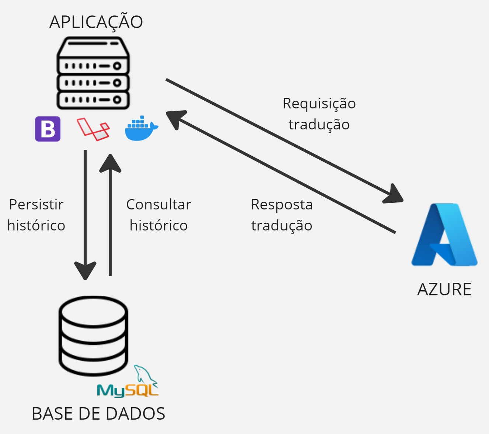

# Translator

Este projeto é uma aplicação prática que reflete conceitos aprendidos ao longo da minha trajetória como estudante e desenvolvedor. Desenvolvido com o poderoso framework PHP Laravel, o sistema utiliza o serviço de tradução da Microsoft Azure para fornecer traduções rápidas e precisas entre diversos idiomas.

Atualmente, o foco está na tradução de frases, com suporte para uma ampla variedade de idiomas. Além disso, planejo expandir suas funcionalidades para incluir a tradução de documentos e/ou imagens no futuro. Todas as traduções realizadas são armazenadas em um banco de dados local, permitindo consulta e registro histórico de maneira eficiente.

**A imagem a seguir apresenta uma exemplificação simplificada do projeto:**



**Algumas das tecnologias utilizadas:**

- Laravel 10
- Mysql 8
- Templates Blade (nativo do Laravel)
- Bootstrap 5.3
- Docker e Docker Compose
- Git e GitHUb
- Microsoft Azure Translator
- Vite
- Rest Api

## Instalação:

### Passo a passo
Clone Repositório
```sh
git clone https://github.com/FlorisvaldoAntonio2/tradutor.git
```
```sh
cd tradutor
```


Copiar o arquivo .env
```sh
cp .env.example .env
```


Atualize as variáveis de ambiente do arquivo .env
```dosini
APP_NAME="Translator"
APP_URL={URL_DO_PROJETO}

DB_CONNECTION=mysql
DB_HOST=db
DB_PORT=3306
DB_DATABASE=translator
DB_USERNAME={NOME_DO_USUARIO}
DB_PASSWORD={SENHA_DO_USUARIO}

AZURE_CLIENT_SECRET={SEU-SEGREDO}
AZURE_REGION={SUA-REGIÃO}
AZURE_URL={URL-API-AZURE}

```

Suba os containers do projeto
```sh
docker-compose up -d
```

ou 

Suba os containers do projeto rebuildando
```sh
docker-compose up -d --build
```


Acesse o container app
```sh
docker-compose exec app bash
```


Instale as dependências do projeto
```sh
composer install
```


Gere a key do projeto Laravel
```sh
php artisan key:generate
```

Gerar as tabelas do banco de dados
```sh
php artisan migrate
```

Gerar link simbólico entre o storage e a pasta public
```sh
php artisan storage:link
```

Instalar pacotes JS
```sh
npm install
```

Buildar
```sh
npm run build
```


Acesse o projeto.


